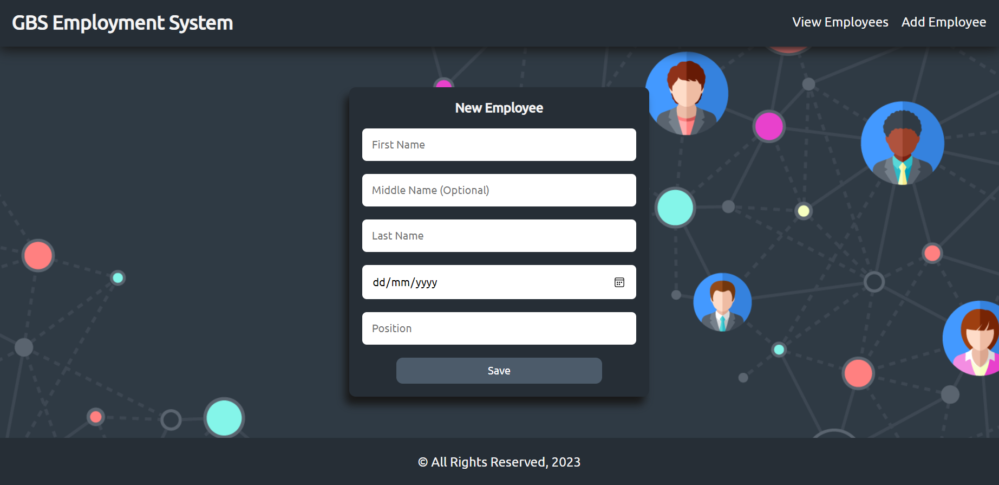

# GBS Associate Java Case Study - Employment System

An Employment System created for a GBS HR Manager to track employee compensation. Different types of compensation are
tracked such as monthly salary, bonuses, commission, etc.

The following technologies are used in building this project:
* Spring
* Spring Boot
* Spring Data JPA
* MySQL
* Java Server Pages (JSP)
* JSTL
* Vanilla CSS

### Project preview:
