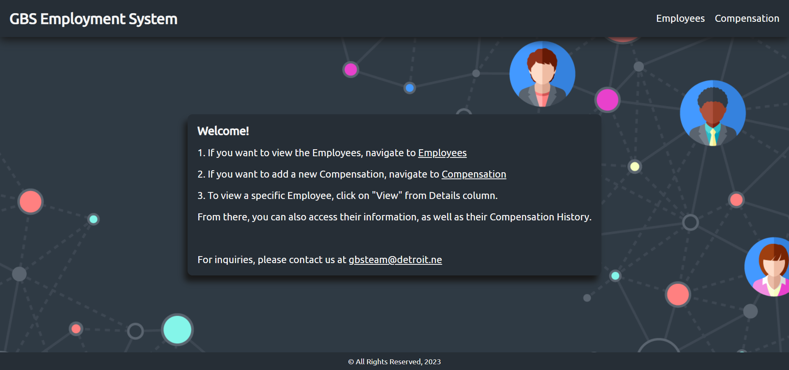
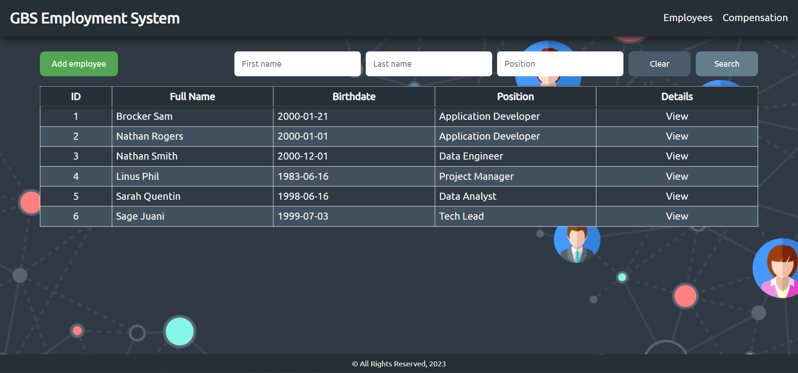
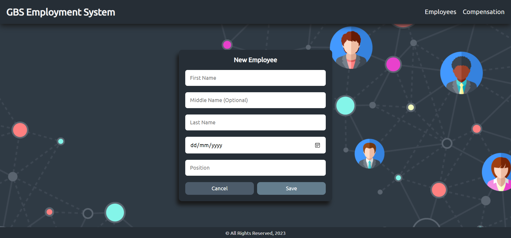
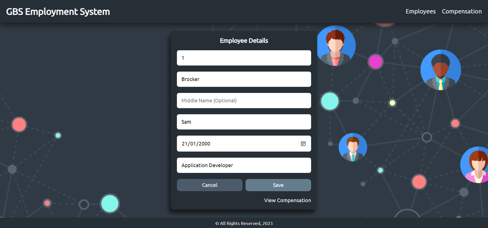
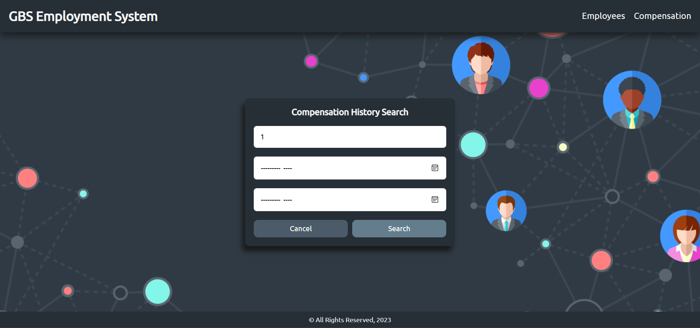
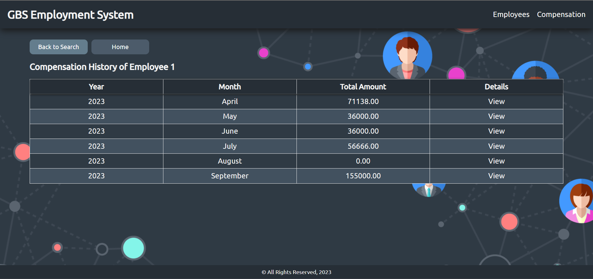
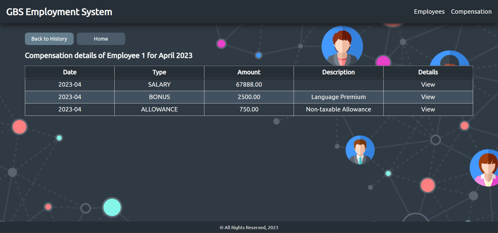

# GBS Associate Java Case Study - Employment System

An Employment System created for GBS HR Managers to track employee compensation. Different types of compensation are
tracked such as monthly salary, bonuses, commission, etc.

The following technologies are used in building this project:
* Spring
* Spring Boot
* Spring Data JPA
* MySQL
* Java Server Pages (JSP)
* JSTL
* Vanilla CSS
* Vanilla JavaScript

### Project preview:

#### Home

#### Employees

#### Add Employee

#### View Employee

#### Add Compensation

#### Compensation History Search

#### View Compensation History

#### View Compensation Breakdown Details
